# 📱 Personnel Manager App – Quản lý nhân sự khoa CNTT

Ứng dụng Android hỗ trợ quản lý nhân sự cho Khoa Công nghệ Thông tin, Trường Đại học X. Phục vụ cán bộ và nhân viên trong việc theo dõi thông tin cá nhân, quá trình công tác, gửi/duyệt đơn từ, nhận thông báo, và nhiều tính năng hỗ trợ quản lý khác.

---

## 📱 Giao diện người dùng

### 🔐 Xác thực

<table>
  <tr>
    <td align="center"><strong>Xác thực OTP</strong></td>
    <td align="center"><strong>Quên mật khẩu</strong></td>
    <td align="center"><strong>Đăng nhập</strong></td>
    <td align="center"><strong>Đổi mật khẩu</strong></td>
    <td align="center"><strong>Đặt lại mật khẩu</strong></td>
  </tr>
  <tr>
    <td>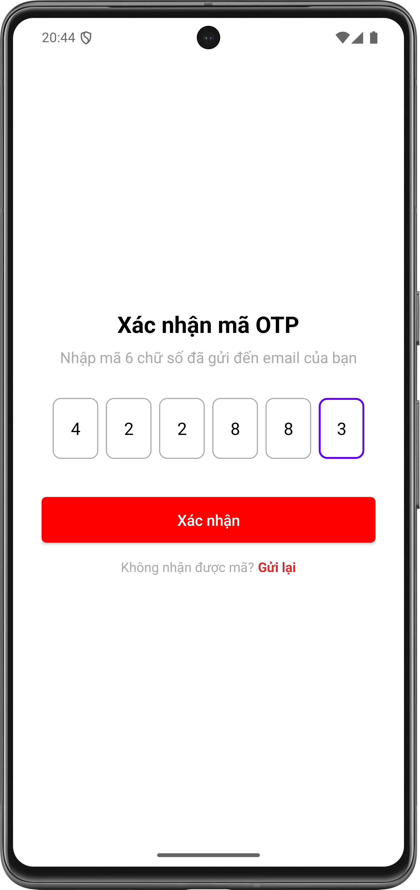</td>
    <td>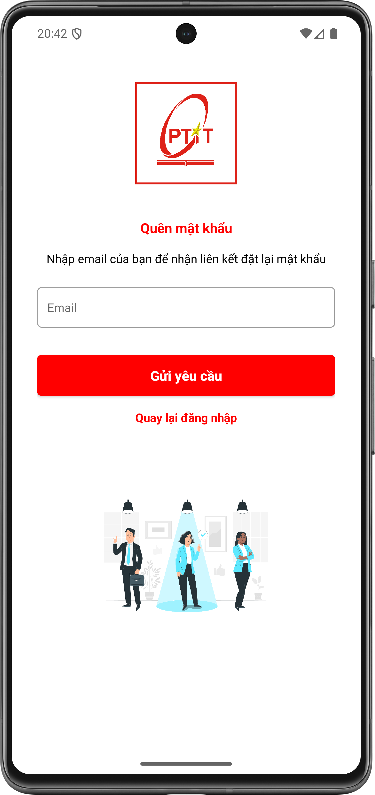</td>
    <td>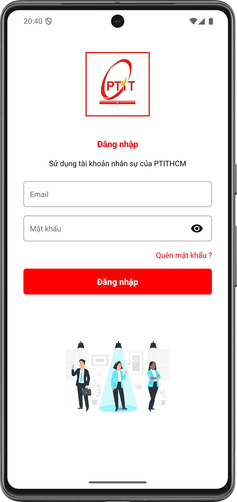</td>
    <td>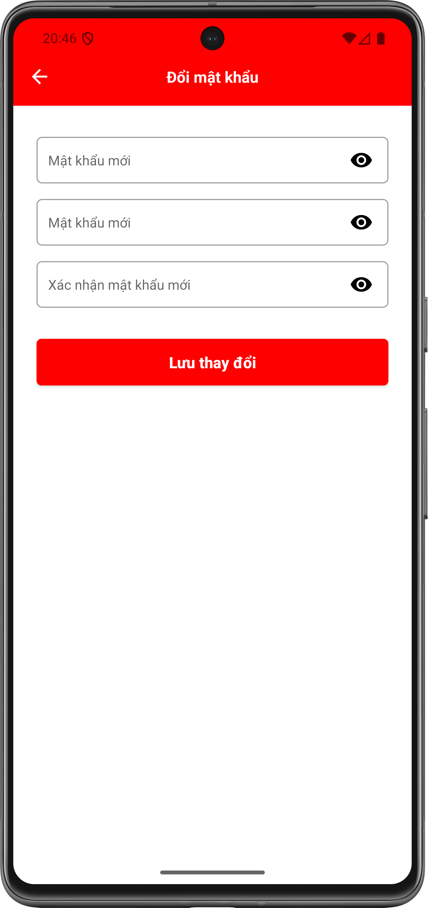</td>
    <td>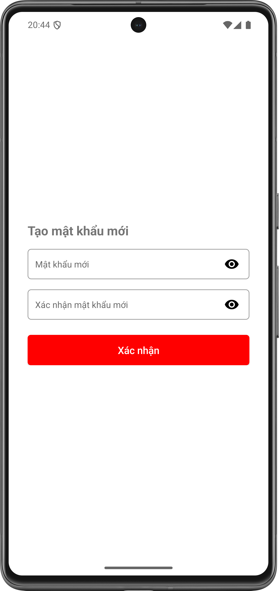</td>
  </tr>
</table>

---

### 🏠 Trang chủ & Điều hướng

<table>
  <tr>
    <td align="center"><strong>Trang chủ</strong></td>
    <td align="center"><strong>Thông báo</strong></td>
    <td align="center"><strong>Thâm niên & Phúc lợi</strong></td>
    <td align="center"><strong>Tài khoản</strong></td>
    <td align="center"><strong>Cài đặt</strong></td>
  </tr>
  <tr>
    <td>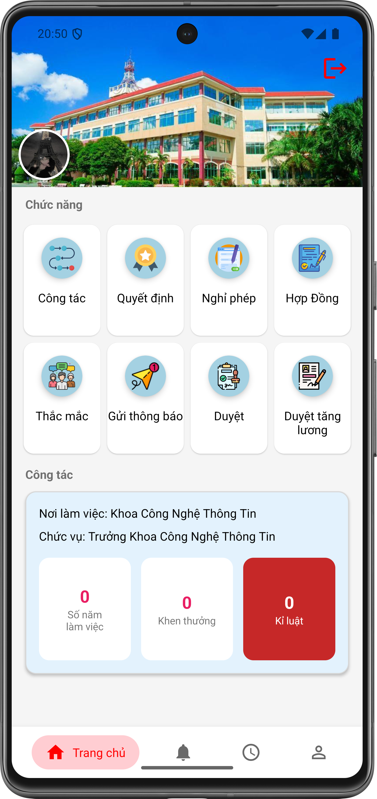</td>
    <td>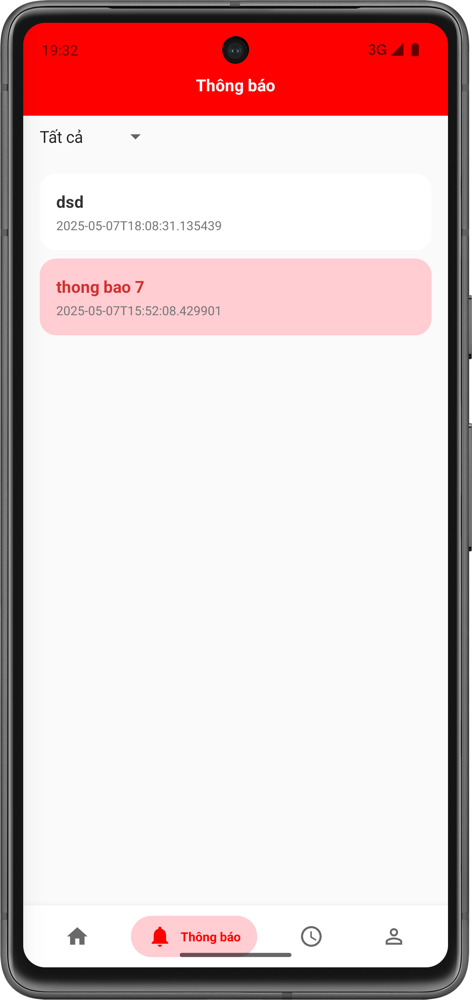</td>
    <td>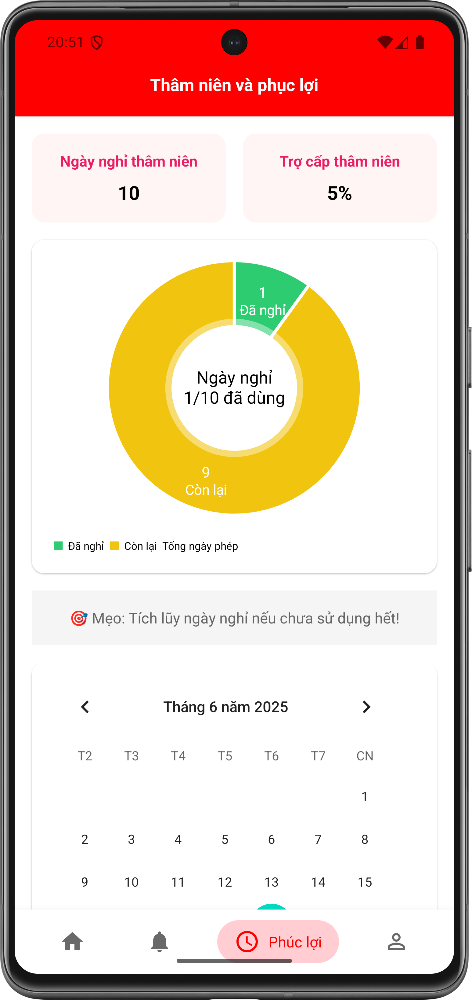</td>
    <td>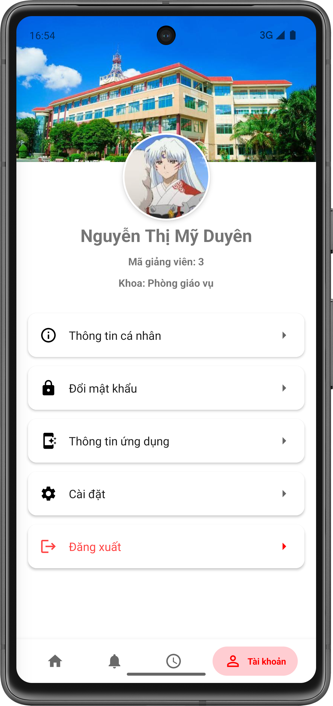</td>
    <td>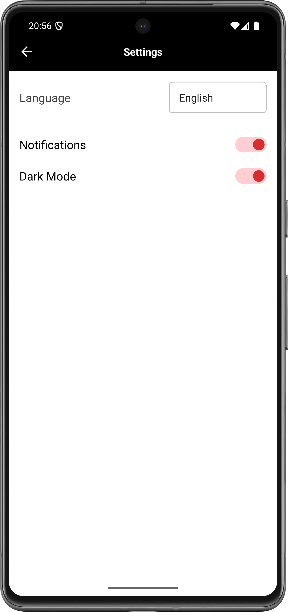</td>
  </tr>
</table>

---

### 📄 Yêu cầu nghỉ phép

<table>
  <tr>
    <td align="center"><strong>Gửi yêu cầu</strong></td>
    <td align="center"><strong>Lịch sử yêu cầu</strong></td>
    <td align="center"><strong>Duyệt yêu cầu</strong></td>
  </tr>
  <tr>
    <td>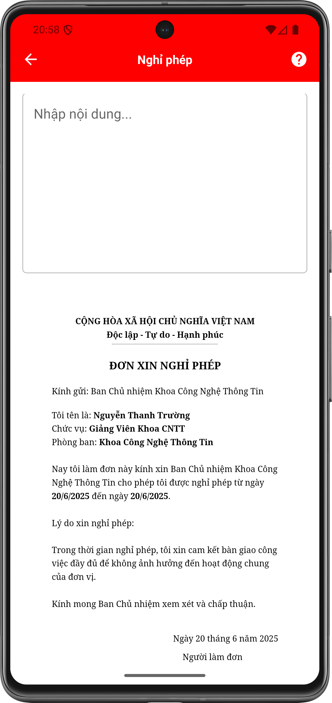</td>
    <td>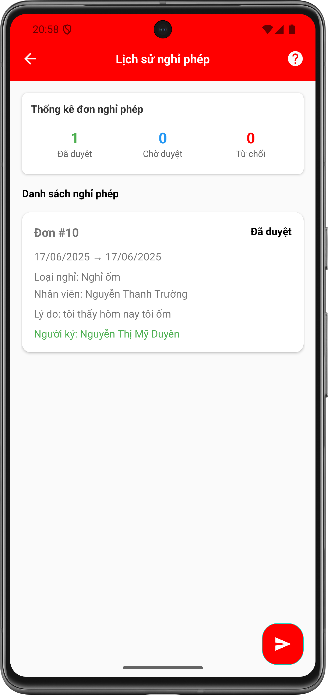</td>
    <td>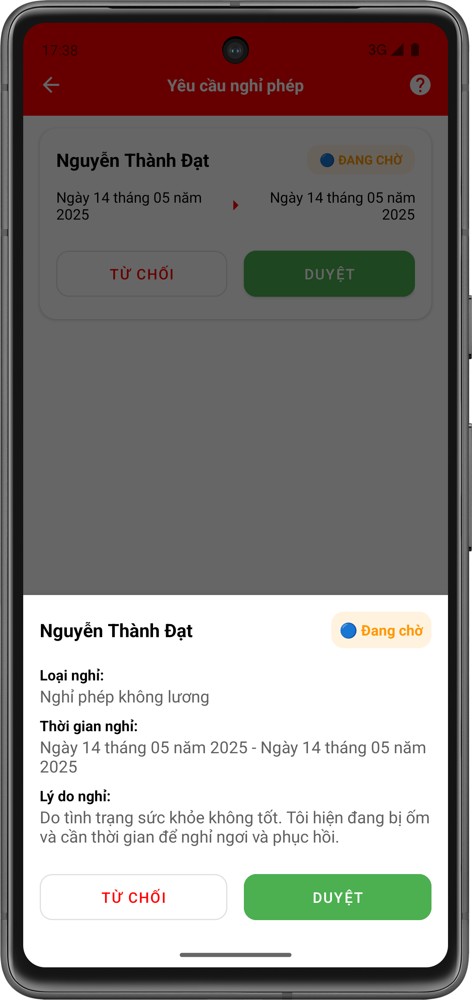</td>
  </tr>
</table>

---

### 👤 Thông tin cá nhân & Quá trình công tác

<table>
  <tr>
    <td align="center"><strong>Thông tin cá nhân</strong></td>
    <td align="center"><strong>Quá trình công tác</strong></td>
  </tr>
  <tr>
     <td>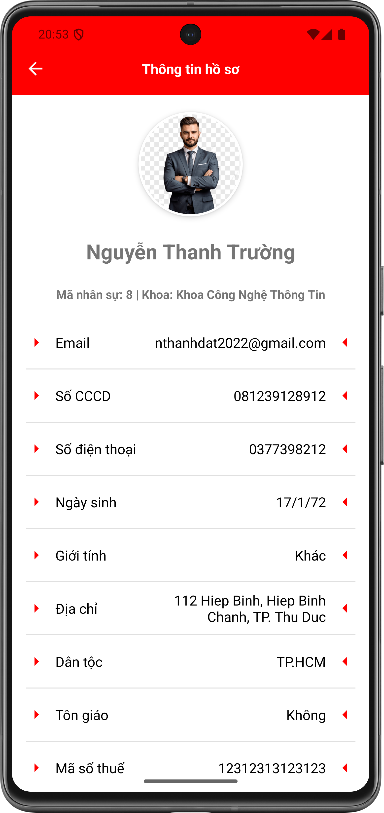</td>
    <td>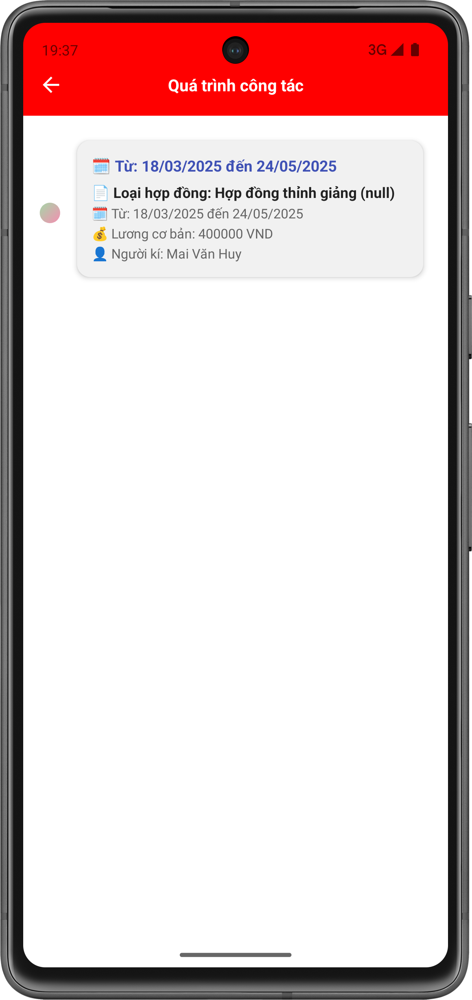</td>
  </tr>
</table>

---

### 📑 Hợp đồng

<table>
  <tr>
    <td align="center"><strong>Danh sách hợp đồng</strong></td>
    <td align="center"><strong>Chi tiết hợp đồng</strong></td>
  </tr>
  <tr>
    <td>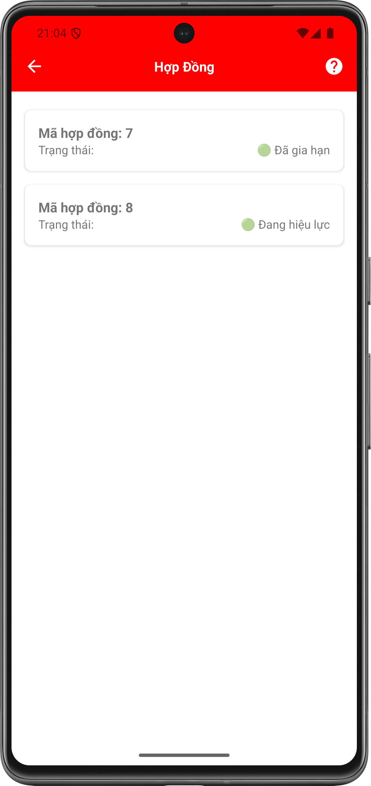</td>
    <td>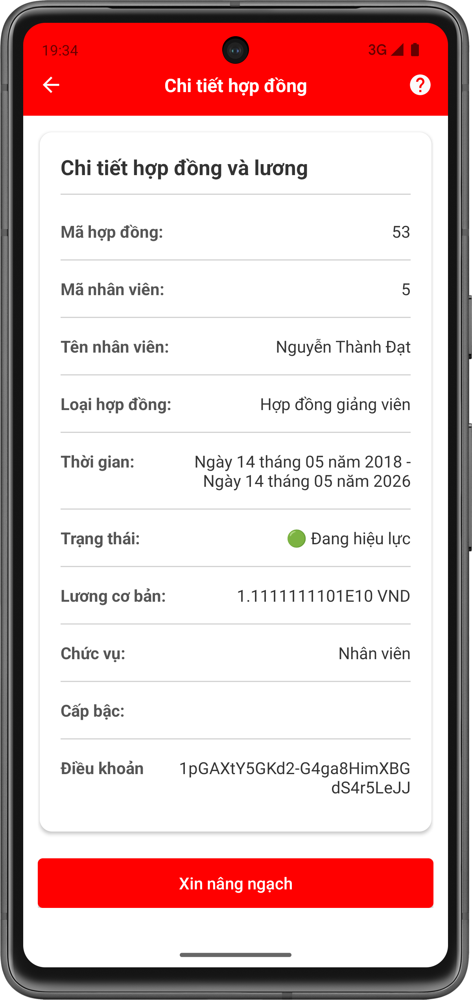</td>
  </tr>
</table>

---

### 📊 Báo cáo

<table>
  <tr>
    <td align="center"><strong>Báo cáo lương hàng tháng</strong></td>
    <td align="center"><strong>Báo cáo hợp đồng sắp hết hạn</strong></td>
  </tr>
  <tr>
    <td>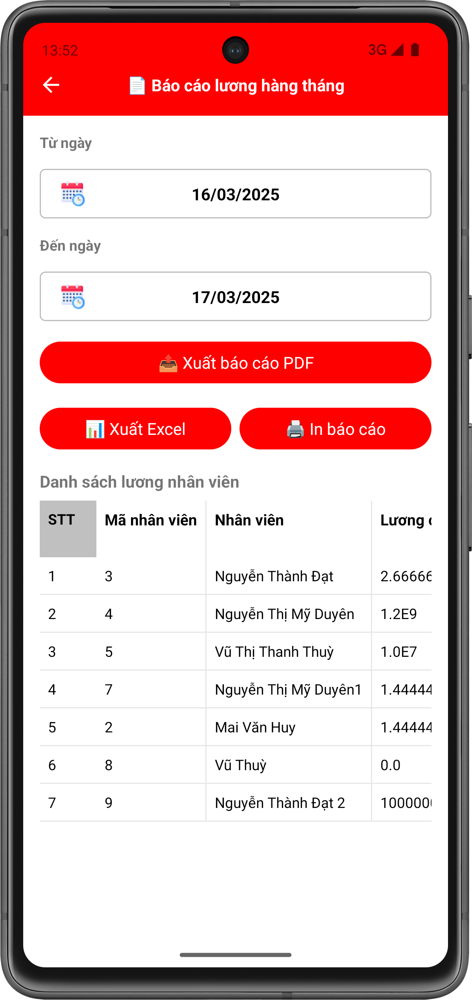</td>
    <td>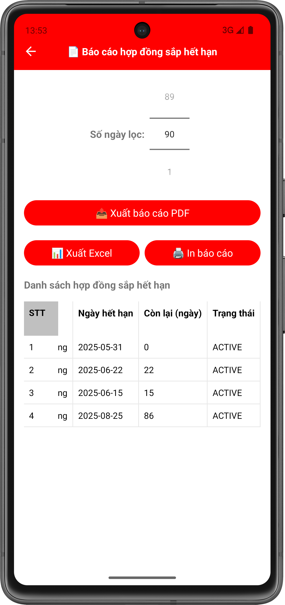</td>
  </tr>
</table>

---

### 📢 Gửi thông báo & Góp ý

<table>
  <tr>
    <td align="center"><strong>Gửi cá nhân</strong></td>
    <td align="center"><strong>Gửi phòng ban</strong></td>
    <td align="center"><strong>Góp ý</strong></td>
  </tr>
  <tr>
    <td>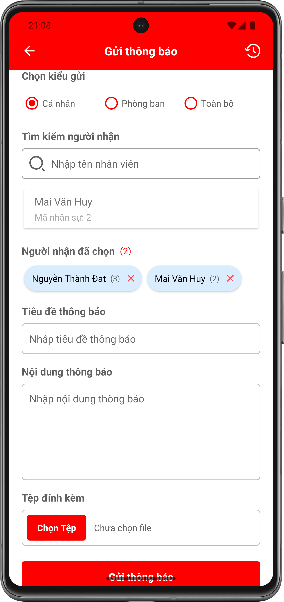</td>
    <td>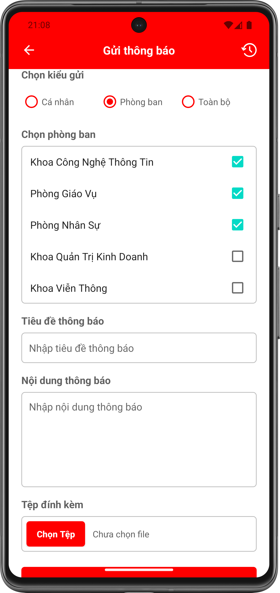</td>
    <td>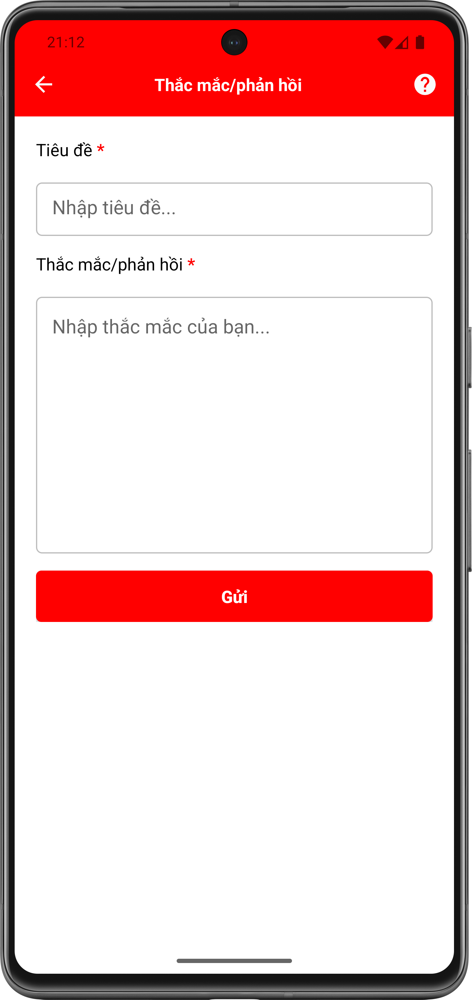</td>
  </tr>
</table>

---

## 🧩 Kiến trúc

- **Clean Architecture**
- **MVVM (Model - View - ViewModel)**
- **Repository Pattern**
- **Single Activity – Multiple Fragment**
- **Dependency Injection với Hilt**

## ⚙️ Tính năng nổi bật

### 🧑‍💼 Cá nhân
- Đăng nhập / Đăng xuất
- Quên mật khẩu
- Xem thông tin cá nhân (hồ sơ)
- Đổi mật khẩu
- Cài đặt:
  - Đổi ngôn ngữ (Tiếng Việt / English)
  - Bật/tắt thông báo
  - Giao diện sáng / tối

### 📄 Hồ sơ & Quyết định
- Xem **quá trình công tác**
- Xem **các quyết định**:
  - Kỷ luật
  - Khen thưởng
  - Tăng lương
- Xem **hợp đồng lao động**
- Xem **thâm niên – phúc lợi**

### 📆 Nghỉ phép
- Gửi **đơn nghỉ phép**
- Xem **lịch sử nghỉ phép**
- **Duyệt đơn nghỉ phép** (dành cho `Manager`)

### 📊 Báo cáo
- Thống kê **lương nhân viên** (quyền: `Staff`, `Admin`)
- Theo dõi **thời hạn hợp đồng** sắp hết hạn (quyền: `Manager`, `Staff`, `Admin`)

### 📣 Thông báo & Phản hồi
- Gửi thông báo:
  - Gửi cho **cá nhân**
  - Gửi cho **nhóm người**
  - Gửi cho **phòng ban**
  - Gửi cho **toàn bộ nhân sự** (quyền: `Manager`, `Staff`, `Admin`)
- Nhận và xem thông báo đã được gửi đến
- Gửi **thắc mắc, phản hồi, góp ý**

---

## 📦 Các thư viện sử dụng

### 🧱 Core Android

* **AppCompat**, **Material Design**, **ConstraintLayout**, **Activity KTX** – Cấu trúc UI và tương thích ngược.

### 🔄 AndroidX & Lifecycle

* **Lifecycle (LiveData, ViewModel)** – Quản lý vòng đời và dữ liệu UI.
* **RecyclerView**, **SwipeRefreshLayout** – Hiển thị danh sách và làm mới dữ liệu.
* **Security Crypto** – Mã hóa dữ liệu an toàn.
* **FlexboxLayout** – Giao diện linh hoạt như CSS Flexbox.

### 🧭 Navigation

* **Navigation Component** – Điều hướng Fragment an toàn, hỗ trợ Safe Args.

### 🌐 Mạng và API

* **Retrofit + Gson Converter** – Gọi REST API, parse JSON.
* **OkHttp + Logging Interceptor** – HTTP client và ghi log request/response.
* **Retrofit RxJava3 Adapter** – Tích hợp RxJava với Retrofit.

### 📷 Tải ảnh

* **Glide** – Tải ảnh hiệu suất cao, cache thông minh.

### 🧩 Dependency Injection

* **Hilt (Dagger)** – Tiêm dependency tự động, đơn giản hóa quản lý lớp phụ thuộc.

### 🔁 Bất đồng bộ

* **RxJava 3 + RxAndroid** – Xử lý luồng dữ liệu và bất đồng bộ trên Android.

### 🔥 Firebase

* **Firebase Analytics**, **Firebase Cloud Messaging** – Theo dõi hành vi người dùng và push notification.

### 🎨 UI nâng cao

* **Chip Navigation Bar** – Thanh điều hướng đáy dạng chip hiện đại.
* **Lottie** – Animation đẹp mượt, file JSON.
* **MPAndroidChart** – Vẽ biểu đồ (line, bar, pie...).
* **TimelineView** – Hiển thị tiến trình theo dòng thời gian.
* **TableView** – Hiển thị bảng dữ liệu dạng Excel.

### 📤 Xuất báo cáo

* **Apache POI** – Tạo file Excel (.xls, .xlsx).
* **iText HTML to PDF** – Convert HTML sang PDF.

---

## 🚀 Hướng dẫn chạy app

1. Clone project
2. Thêm file `google-services.json` vào thư mục `app/`
3. Sync Gradle
4. Build và chạy app trên thiết bị thật hoặc AVD Android 8.0+

---

## 🛠️ Môi trường phát triển

- IDE: **Android Studio Hedgehog**
- Ngôn ngữ: **Java**, một phần Kotlin DSL trong Gradle
- Min SDK: **26** (Android 8.0)
- Target SDK: **35**

---

## 📌 Ghi chú

App hỗ trợ đa quyền (`User`, `Manager`, `Staff`, `Admin`) với giao diện và tính năng tùy theo phân quyền. Có khả năng mở rộng dễ dàng do sử dụng Clean Architecture và DI bằng Hilt.

